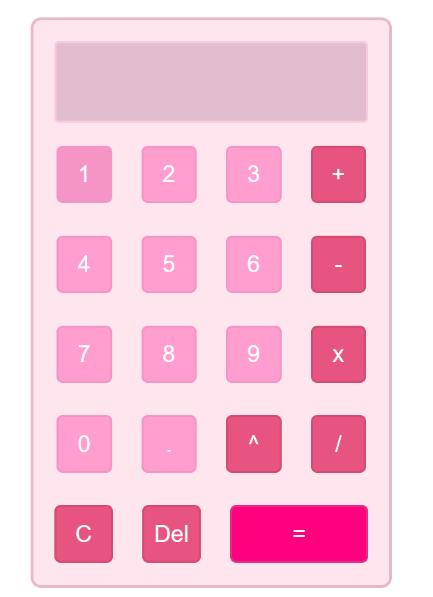

# Pink Calculator  

A simple and stylish calculator built with **HTML, CSS (Flexbox), and JavaScript**.  
This project is part of my learning journey, practicing DOM manipulation, event listeners, and calculator logic without using `eval()`.  

---

## ✨ Features  

- Basic arithmetic operations: `+`, `-`, `×`, `÷`, `^` (power)  
- Decimal number support  
- Rounds long decimal results to 3 decimal places  
- Handles division by zero with an error message (`Math Error`)  
- Chained operations supported (`12 + 7 - 1 = 18`)  
- Clear (C) button resets everything  
- Responsive design with **Flexbox** layout  
- Button hover & press effects for better UI experience  

---

## 📸 Screenshot  

  

---

## 🛠️ Tech Stack  

- **HTML5** – structure  
- **CSS3 (Flexbox)** – layout & design  
- **JavaScript (Vanilla)** – calculator logic  

---

## 🚀 How to Use  

1. Clone this repository:  
   ```bash
   git clone https://favibe.github.io/Pink-Calculator/
